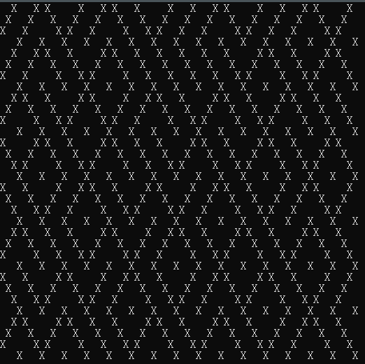
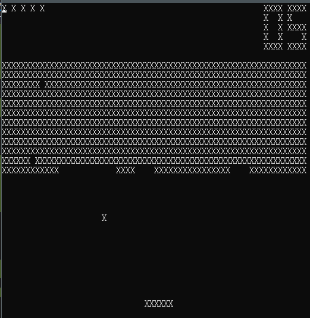

# SharpEight
A C# implementation of CHIP-8 emulator.

CHIP-8 defination: https://en.wikipedia.org/wiki/CHIP-8

# Usage
```
SharpEight.exe {ROM_PATH}
```

This will load your CHIP-8 executable and run.

You can find more ROMs at this [repo](https://github.com/dmatlack/chip8)

# Screenshots



Any contributions are welcome.

2019-2020, net2cn.